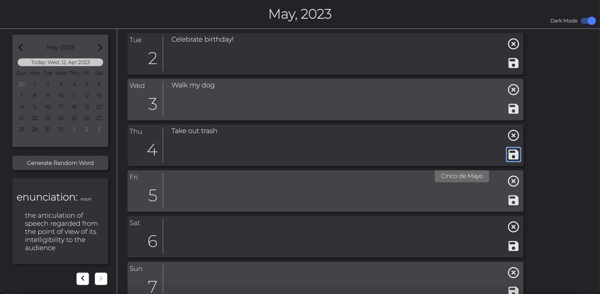
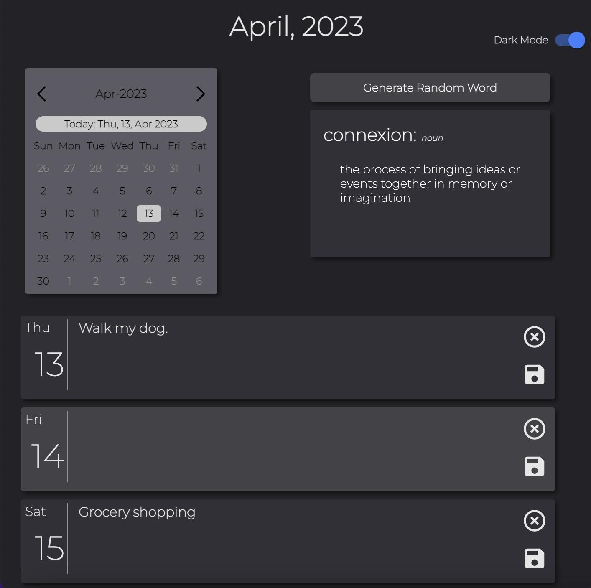
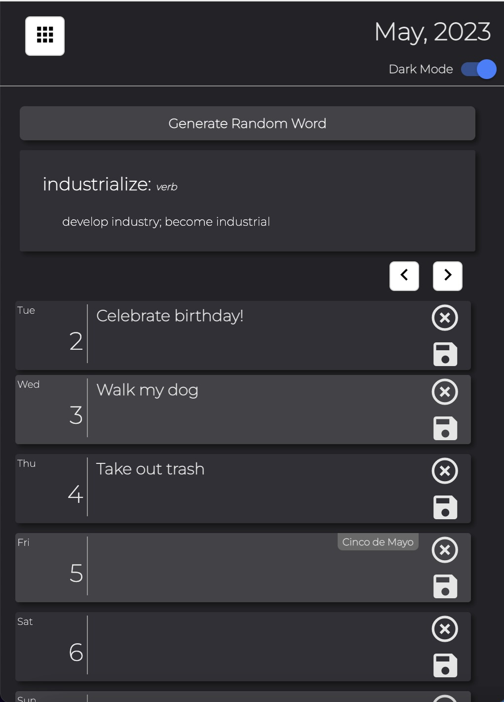

# Random-Word-Calendar

## Description

This project allows the user to save events on a calendar for any date, along with letting the user view randomly generated words and their definitions. The purpose of this is to engage the user with new information while they plan out their schedule. Two API's are used to accomplish this, the first is a Google Calendar API used to retrieve holiday information and display them, along with a Words API to display the random words.

## Usage

Click the following link to view the application: https://amman98.github.io/Random-Word-Calendar/. Viewing the webpage, you will see 7 textboxes for the current week, feel free to use the calendar overview to choose which dates to view (on mobile view, click the button on the top left to access the calendar). Once you've typed and event for a given day, hit the save button and the event will be recorded for future use. You can also click the 'Generate Random Word' button to display a word and its definition.

## Credits

Amman Nega: https://github.com/amman98

Tanya Silyutina: https://github.com/TanyaSilyutina

Taylor Orsini: https://github.com/TayloRib

### API Documentation

Holiday API: https://developers.google.com/calendar

Words API: https://www.wordsapi.com/

### Resources

Calendar Framework: https://codepen.io/alvarotrigo/pen/bGLpROa

Toggle Button Framework: https://ionicframework.com/docs/

Building Query Strings: https://stackoverflow.com/questions/316781/how-to-build-query-string-with-javascript

Replace Function: https://futurestud.io/tutorials/remove-all-whitespace-from-a-string-in-javascript

## License

Please refer to the LICENSE in the repo.